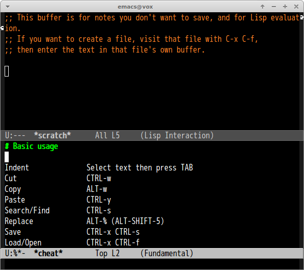

# cheat

Use [cheat](https://github.com/dufferzafar/cheat) command from Emacs. This is inspired by [vim-cheat](https://github.com/mattn/vim-cheat).

## Screen shot

## Requirement

- [cheat command](https://github.com/dufferzafar/cheat)
- [cheat sheets](https://github.com/chrisallenlane/cheat)

## Usage

#### `M-x cheat`

Show cheat sheet of command
